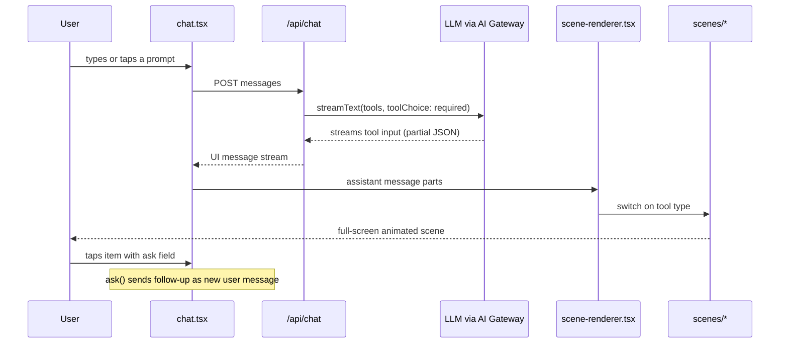
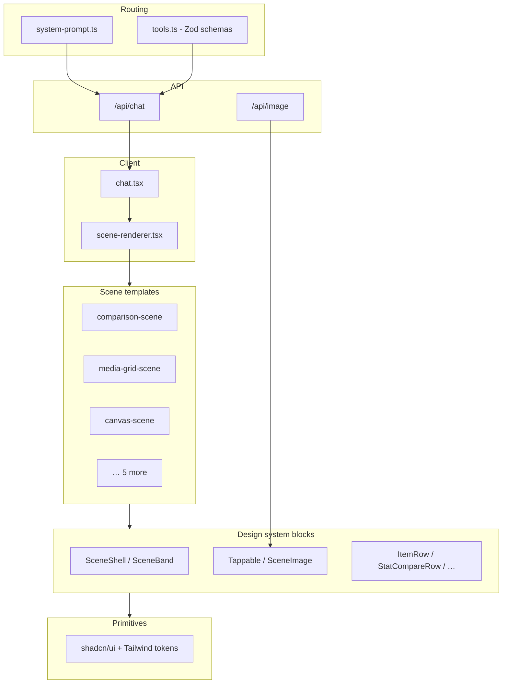
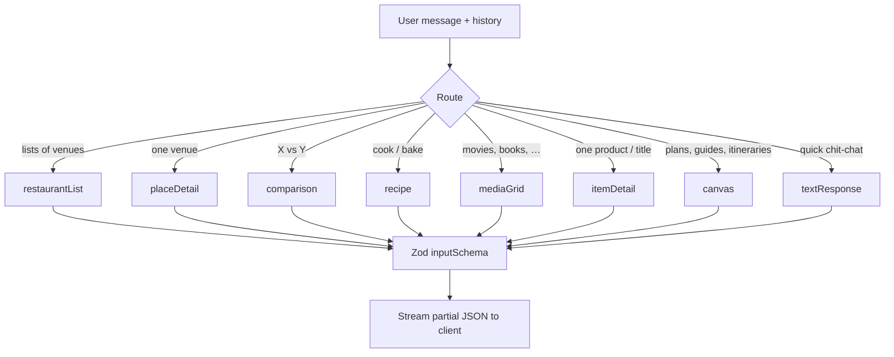
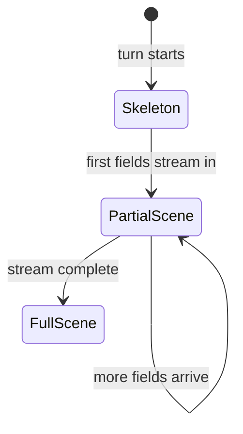
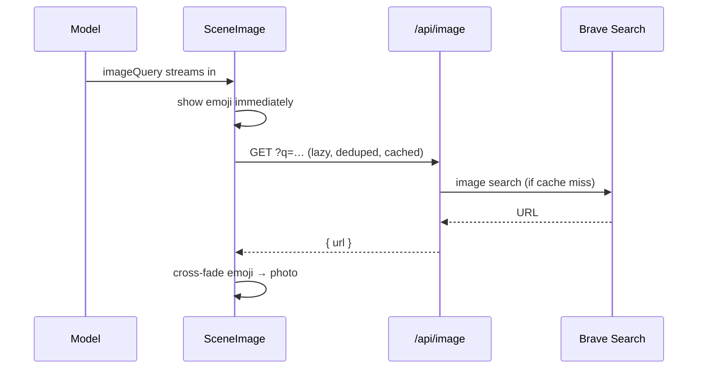
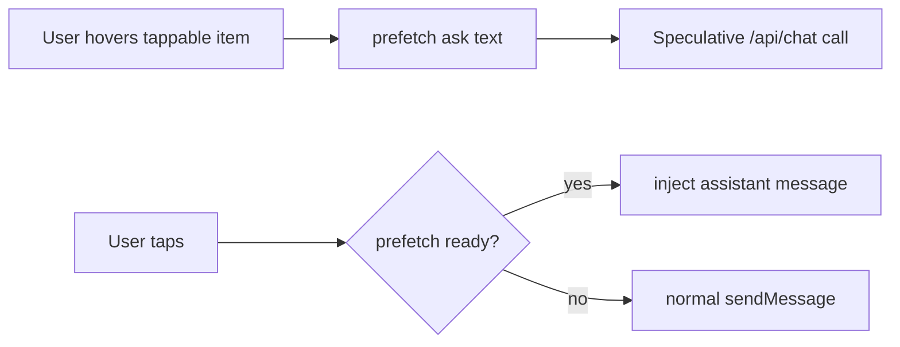
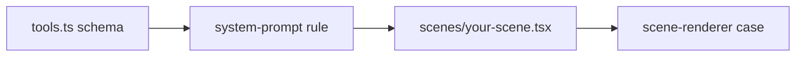

# Airchat architecture

How generative UI works in this codebase: scene rendering, the design system, and how the model picks what to show.

Live demo: [useairchat.vercel.app](https://useairchat.vercel.app)

---

## TL;DR

- The model **never returns markdown**. Every turn is **exactly one tool call**.
- The tool's **JSON input is the UI** - it streams field-by-field to the client.
- React **scene components** render that data using a shared **block** design system.
- The model **chooses among predefined scene types** (and composes `canvas` sections); it does not generate arbitrary JSX at runtime.

---

## End-to-end flow

### Server (`app/api/chat/route.ts`)

| Setting | Effect |
| --- | --- |
| `tools: sceneTools` | All scene schemas from `lib/ai/tools.ts` |
| `toolChoice: "required"` | Model must call a tool - no plain-text replies |
| `stopWhen: stepCountIs(1)` | One tool call per turn, then stop |
| `execute: async () => ({ displayed: true })` | Tools are UI schemas, not server actions |

Rate limiting runs per IP before the model is called (`lib/rate-limit.ts`).

### Client (`components/chat/`)

- **`useChat`** receives streaming tool input.
- **`scene-renderer.tsx`** maps `tool-*` part types to scene components.
- **`SceneActionsContext`** exposes `ask()` and `prefetch()` for tappable drill-down.
- **Scroll camera** in `chat.tsx` glides each new turn to fill the viewport (custom rAF smoothing - not `scrollIntoView`).

---

## Layer diagram

---

## Design system (three layers)

The model does **not** pick React components from a runtime catalog. Developers define scenes; the model fills schemas.

### Layer 1 - Primitives (`components/ui/`)

shadcn/ui: Dialog, Skeleton, Tooltip, etc.  
Global tokens and utilities in `app/globals.css` (light/dark, Geist, `.glass`, `--ease-out-strong`).

### Layer 2 - Blocks (`components/blocks/`)

Reusable scene building blocks:

| Block | Purpose |
| --- | --- |
| `SceneShell` | Full-viewport scene wrapper, entrance fade |
| `SceneIntro` | Conversational one-liner at top |
| `SceneBand` | Full-width section; alternate `plain` / `muted` tone |
| `Stagger` / `StaggerItem` | Staggered list reveal |
| `Tappable` | Wraps clickable items; fires `ask()`; prefetches on hover |
| `SceneImage` | Emoji placeholder → lazy `/api/image` photo |
| `ItemRow`, `MediaTile`, `StatCompareRow`, … | Domain-specific rows and tiles |

### Layer 3 - Scenes (`components/scenes/`)

One React component per tool - fixed layout templates:

| Tool | Component |
| --- | --- |
| `restaurantList` | `restaurant-list-scene.tsx` |
| `placeDetail` | `place-detail-scene.tsx` |
| `comparison` | `comparison-scene.tsx` |
| `recipe` | `recipe-scene.tsx` |
| `mediaGrid` | `media-grid-scene.tsx` |
| `itemDetail` | `item-detail-scene.tsx` |
| `canvas` | `canvas-scene.tsx` |
| `textResponse` | `text-response-scene.tsx` |

---

## How the AI chooses a scene

Two inputs guide the model: **tool descriptions** in `lib/ai/tools.ts` and **routing rules** in `lib/ai/system-prompt.ts`.

### Browse vs detail (important)

| User intent | Scene |
| --- | --- |
| "Recommend a movie", "best sushi" | **Browse** - `mediaGrid`, `restaurantList` (multiple options) |
| "Tell me more about La La Land", "Mizumi" | **Detail** - `itemDetail`, `placeDetail` (one named thing) |

This rule lives in the system prompt so singular phrasing ("recommend me *a* movie") still gets a grid, not a single-item detail page.

### Shared schema fields

| Field | Purpose |
| --- | --- |
| `intro` | Warm one-sentence voice line at top of scene |
| `ask` | Follow-up prompt when user taps an item |
| `imageQuery` | 2–5 word Brave image search query; emoji is fallback |

---

## Streaming and partial data

Tool input arrives **incrementally** while the model generates. Every scene accepts `DeepPartial` input (`components/scenes/types.ts`).

- **`SceneSkeleton`** shows until any tool input exists.
- **`scene-renderer.tsx`** crossfades skeleton → scene with `AnimatePresence mode="popLayout"`.
- Components must render with `undefined` fields - never assume the full object is present.

---

## Canvas: the most generative scene

For requests that don't fit a dedicated template, the model uses **`canvas`**: an ordered list of 2–7 sections.

Section kinds (fixed enum - not free-form JSX):

| Kind | Renders as |
| --- | --- |
| `hero` | Big image/emoji + title + one-liner |
| `prose` | Heading + paragraph |
| `bullets` | Emoji-led points (tappable if `ask` set) |
| `stats` | Value + label strip |
| `cards` | Tappable card grid |
| `steps` | Numbered sequence |
| `timeline` | Time-labeled entries |
| `gallery` | Visual tile grid |
| `quote` | Pull quote |

The model acts as **designer** (section order and content). `canvas-scene.tsx` acts as **renderer** (consistent bands, rhythm, motion).

---

## Images

Caching: in-memory, Next.js data cache (30 days), CDN, browser. Queries are normalized to reduce duplicate Brave calls.

---

## Drill-down and prefetch

- **`Tappable`** reads `ask` from model-authored schema data.
- **`useAskIntent`** debounces hover/touch and starts a speculative stream (max 3 in flight).
- Tap sends the `ask` string as the next user message; routing rules + history pick the next scene.

---

## Monogram-style generative UI vs Airchat today

| | Monogram (ideal) | Airchat (this repo) |
| --- | --- | --- |
| Layout freedom | Model generates arbitrary UI | Model fills predefined Zod schemas |
| Components | Unlimited | 8 scene types + canvas section composer |
| Runtime | Can imply code generation | Fixed React components |
| Tradeoff | Maximum expressiveness | Predictable streaming, types, polish |

Airchat is **generative within a design system** - a practical v1 that ships, streams reliably, and has one place to refine motion and layout.

---

## Launch readiness (honest snapshot)

**Ready as a demo / OSS project.** **Not ready as unlimited public production** without more guardrails.

| Ready | Gap |
| --- | --- |
| Core ask → scene → drill-down loop | No auth on hosted demo |
| Deployed + rate-limited API routes | In-memory limits (per serverless instance) |
| OSS docs, MIT license, deploy button | No conversation persistence |
| Strong Lighthouse scores | Content is model-invented, not fact-checked |
| | No production monitoring / analytics |

**Recommendation:** Launch as *"Try Airchat - generative UI chat demo."* Position self-hosting + BYOK for heavy use. Tighten demo limits or add auth before marketing it as always-free infrastructure.

---

## Adding a new scene

1. **`lib/ai/tools.ts`** - add tool with Zod `inputSchema` + description.
2. **`lib/ai/system-prompt.ts`** - when the model should pick it.
3. **`components/scenes/your-scene.tsx`** - compose from `components/blocks/`.
4. **`components/chat/scene-renderer.tsx`** - `case "tool-yourScene":`.

See [CONTRIBUTING.md](./CONTRIBUTING.md) for PR conventions and [AGENTS.md](./AGENTS.md) for agent/coding conventions.

---

## Key files

| Path | Role |
| --- | --- |
| `lib/ai/tools.ts` | Scene tool schemas (the UI contract) |
| `lib/ai/system-prompt.ts` | Routing rules and product identity |
| `lib/ai/model.ts` | Gateway model ID + fallbacks |
| `app/api/chat/route.ts` | Streaming tool-call endpoint |
| `app/api/image/route.ts` | Brave image lookup + cache |
| `components/chat/chat.tsx` | Chat shell, scroll camera, composer |
| `components/chat/scene-renderer.tsx` | Tool type → scene component |
| `components/blocks/` | Shared design-system blocks |
| `components/scenes/` | One full-screen template per tool |
