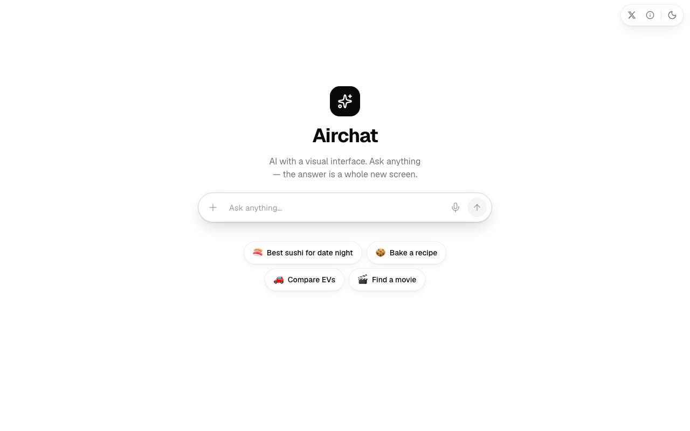
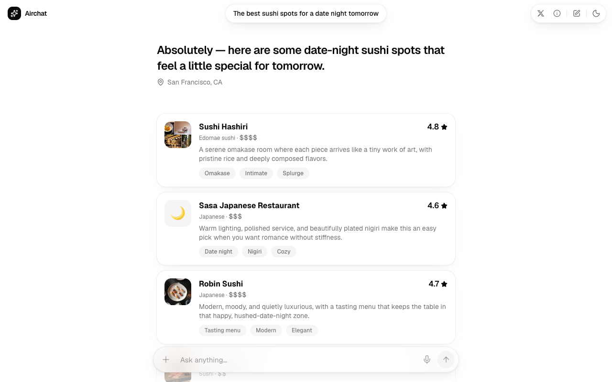
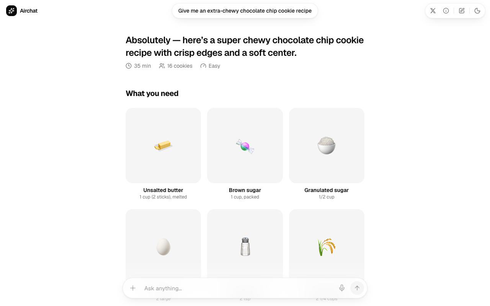

# Airchat

**AI with a visual interface.** Every answer is a full-screen, interactive scene — not a wall of text.

Live demo: **[useairchat.vercel.app](https://useairchat.vercel.app)**

Inspired by [Monogram](https://www.monogram.ai/) — a chat where the model designs the UI on every turn.

<p align="center">
  
</p>

<p align="center">
  
</p>

<p align="center">
  
</p>

## What it does

- Ask for sushi spots, compare EVs, bake a recipe, pick a movie — the model picks a **scene tool** and streams structured UI you can tap into.
- **Drill down**: tappable items carry follow-up prompts; hover prefetches the next scene.
- **Images**: the model authors search queries; Brave Image Search fills in photos with heavy caching.
- **Canvas**: for open-ended asks, the model composes custom pages from sections (hero, cards, timeline, gallery, …).

## Stack

- [Next.js](https://nextjs.org) App Router · [AI SDK v6](https://ai-sdk.dev) · [Vercel AI Gateway](https://vercel.com/docs/ai-gateway)
- [Tailwind CSS v4](https://tailwindcss.com) · [shadcn/ui](https://ui.shadcn.com) · [Motion](https://motion.dev) · [Geist](https://vercel.com/font)

## Run locally

**You bring your own API keys** — nothing is bundled.

1. Clone and install:

   ```bash
   git clone https://github.com/newyorkcompute/airchat.git
   cd airchat
   npm install
   ```

2. Copy env and add keys:

   ```bash
   cp .env.example .env.local
   ```

   | Variable | Required | Where to get it |
   | --- | --- | --- |
   | `AI_GATEWAY_API_KEY` | Yes | [Vercel AI Gateway](https://vercel.com/docs/ai-gateway) → API Keys |
   | `BRAVE_SEARCH_API_KEY` | Yes (for images) | [Brave Search API](https://brave.com/search/api/) |
   | `AIRCHAT_MODEL` | No | Any `provider/model` slug on the gateway; default `openai/gpt-5.4-mini` |

3. Start the dev server:

   ```bash
   npm run dev
   ```

   Open [http://localhost:3000](http://localhost:3000).

## Deploy

[](https://vercel.com/new/clone?repository-url=https%3A%2F%2Fgithub.com%2Fnewyorkcompute%2Fairchat&env=AI_GATEWAY_API_KEY,BRAVE_SEARCH_API_KEY&envDescription=API%20keys%20for%20Airchat&project-name=airchat)

Set `AI_GATEWAY_API_KEY` and `BRAVE_SEARCH_API_KEY` in the Vercel project settings. The hosted demo at useairchat.vercel.app is rate-limited — self-host for heavy use.

## Architecture

Every turn the model calls one scene tool; the JSON input streams to the client and a React scene component renders it (`lib/ai/tools.ts` → `scene-renderer.tsx` → `components/scenes/*`, built from `components/blocks/*`).

See **[ARCHITECTURE.md](./ARCHITECTURE.md)** for diagrams, routing rules, the design system, and how to add a scene. [AGENTS.md](./AGENTS.md) covers coding conventions; [CONTRIBUTING.md](./CONTRIBUTING.md) for PRs.

## License

[MIT](./LICENSE) © [newyorkcompute](https://github.com/newyorkcompute)

Built by [Siddharth Kulkarni](https://x.com/siddharthkul).
